# Agentic Literature Review

LangGraph 驱动的 Agentic 文献综述引擎。7 个专业智能体通过 StateGraph 编排，端到端自主执行 检索 → 精读 → 分析 → 评审 → 写作 流水线，内置反馈环路、引用验证与 Human-in-the-loop 门控，交付发表级学术综述。

核心设计：以声明式 DAG 配置驱动节点调度与条件路由，各 Agent 通过共享 ReviewState 进行结构化数据流转 —— LLM 推理结果即时写入状态字段，下游节点按需消费，实现推理工作流与数据流的统一编排。

## 功能特性

**智能体流水线** — 7 个专业 Agent（Intent Parser → Search → Reader → Analyst → Critic → Writer → Update）协作完成端到端文献综述

- 四源并行检索（Semantic Scholar / arXiv / OpenAlex / PubMed），自动查询扩展与去重
- PDF 精读 + LLM 结构化信息提取，主题聚类、方法对比矩阵、研究趋势分析
- 质量评估、矛盾检测、Research Gap 发现，自动修订环路
- 大纲生成 → 逐章写作 → 引用验证（APA/IEEE/GB/T 7714），多格式导出（Markdown / Word / BibTeX / RIS）
- 5 种输出类型：完整综述 / 方法论综述 / 研究空白报告 / 趋势报告 / 研究路线图

**交互与协作** — Human-in-the-loop（3 个确认点）、断点恢复、增量更新、JWT 认证 + RBAC 权限、项目分享、D3.js 可视化

## 技术栈

| 层次       | 技术                                  |
| ---------- | ------------------------------------- |
| 智能体框架 | LangGraph                             |
| LLM        | OpenAI GPT-4o（可配置，支持路由降级） |
| 后端       | Python 3.12 + FastAPI                 |
| 前端       | React 18 + Ant Design 5 + D3.js       |
| 任务队列   | Celery + Redis                        |
| 数据库     | SQLite + ChromaDB                     |
| 认证       | JWT (HS256) + bcrypt + RBAC           |
| 部署       | Docker Compose                        |

## 系统架构

> 详细设计文档见 [docs/design/](docs/design/)




## 快速开始

### Docker 部署（推荐）

前置条件：Docker + Docker Compose、OpenAI API Key

```bash
git clone <repo-url> && cd agentic-literature-review
cp .env.example .env    # 编辑 .env，填入 OPENAI_API_KEY
docker compose up -d
curl http://localhost:8000/healthz   # {"status": "ok"}
```

服务启动后：**Swagger UI** http://localhost:8000/docs | **ReDoc** http://localhost:8000/redoc

### 本地开发

```bash
docker run -d --name redis -p 6379:6379 redis:7-alpine
cd backend && pip install -r requirements.txt
uvicorn app.main:app --reload --port 8000
# 新终端
celery -A app.celery_app:celery_app worker -l info -Q high,default,low
```

### CLI

```bash
cd backend
python -m app.cli review "What are the recent advances in LLM for code generation?"
python -m app.cli review "深度学习在医学影像中的应用" -l zh -s gbt7714
```

## 环境变量

唯一必需变量：`OPENAI_API_KEY`。完整配置项及默认值见 [.env.example](.env.example)。

常用可选变量：`OPENAI_MODEL`（默认 gpt-4o）、`DATABASE_URL`、`REDIS_URL`、`AUTH_REQUIRED`（默认 false）、`S2_API_KEY` / `OPENALEX_EMAIL` / `NCBI_API_KEY`（数据源 API Key，提升速率限制）。

## 项目结构

```
├── backend/
│   ├── app/
│   │   ├── agents/          # 7 个 LangGraph 智能体 + 编排器
│   │   ├── api/routes/      # 11 个 API 路由模块
│   │   ├── sources/         # 4 个数据源适配器
│   │   ├── services/        # LLM / 导出 / 认证 / 事件等服务
│   │   ├── models/          # ORM 模型
│   │   └── schemas/         # Pydantic v2 Schema
│   ├── config/              # 工作流 DAG 配置
│   ├── prompts/             # Jinja2 Prompt 模板
│   └── tests/
├── frontend/src/
│   ├── components/          # UI 组件（9 个模块）
│   ├── pages/               # Home / Login / Project / Settings
│   └── stores/              # Zustand 状态管理
├── docker-compose.yml
└── .env.example
```

## 许可证

MIT
