# 架构设计详细文档

> **版本**: v0.5 | **最后更新**: 2026-03-31
>
> 本文档基于当前代码实现，详细描述系统各层架构的设计细节，供开发者快速理解系统全貌。

---

## 目录

- [架构设计详细文档](#架构设计详细文档)
  - [目录](#目录)
  - [1. 系统总览](#1-系统总览)
  - [2. LangGraph 工作流引擎](#2-langgraph-工作流引擎)
    - [2.1 配置驱动的 DAG 构建](#21-配置驱动的-dag-构建)
    - [2.2 ReviewState 共享状态模型](#22-reviewstate-共享状态模型)
    - [2.3 条件路由与反馈环路](#23-条件路由与反馈环路)
    - [2.4 Human-in-the-Loop 中断机制](#24-human-in-the-loop-中断机制)
    - [2.5 检查点与断点恢复](#25-检查点与断点恢复)
    - [2.6 自动修订循环](#26-自动修订循环)
  - [3. Agent 智能体层](#3-agent-智能体层)
    - [3.1 统一 Agent 接口规范](#31-统一-agent-接口规范)
    - [3.2 Agent 注册中心](#32-agent-注册中心)
    - [3.3 各 Agent 职责与实现](#33-各-agent-职责与实现)
      - [Intent Parser · `parse_intent`](#intent-parser--parse_intent)
      - [Search Agent · `search`](#search-agent--search)
      - [Reader Agent · `read`](#reader-agent--read)
      - [Analyst Agent · `analyze`](#analyst-agent--analyze)
      - [Critic Agent · `critique` + `review_assessment`](#critic-agent--critique--review_assessment)
      - [Writer Agent · `generate_outline` + `write_review` + `revise_review` + `auto_revise`](#writer-agent--generate_outline--write_review--revise_review--auto_revise)
      - [Verify Citations · `verify_citations`](#verify-citations--verify_citations)
      - [Export Node · `export`](#export-node--export)
      - [Update Agent · `update` (v0.5)](#update-agent--update-v05)
  - [4. 外部数据源层](#4-外部数据源层)
    - [4.1 PaperSource 抽象接口](#41-papersource-抽象接口)
    - [4.2 数据源注册中心](#42-数据源注册中心)
    - [4.3 缓存与限速](#43-缓存与限速)
  - [5. 服务层（Services）](#5-服务层services)
    - [5.1 LLM 多模型路由](#51-llm-多模型路由)
    - [5.2 Prompt 模板管理](#52-prompt-模板管理)
    - [5.3 事件通信（Redis Pub/Sub ↔ SSE）](#53-事件通信redis-pubsub--sse)
    - [5.4 论文去重与持久化](#54-论文去重与持久化)
    - [5.5 导出服务](#55-导出服务)
    - [5.6 认证服务](#56-认证服务)
    - [5.7 审计日志](#57-审计日志)
  - [6. API 层（FastAPI）](#6-api-层fastapi)
    - [6.1 路由模块划分](#61-路由模块划分)
    - [6.2 依赖注入与权限模型](#62-依赖注入与权限模型)
    - [6.3 统一错误处理](#63-统一错误处理)
  - [7. 异步任务层（Celery）](#7-异步任务层celery)
    - [7.1 检查点分段执行模型](#71-检查点分段执行模型)
    - [7.2 优雅关停与重试](#72-优雅关停与重试)
  - [8. 数据模型层](#8-数据模型层)
    - [8.1 ORM 模型总览](#81-orm-模型总览)
    - [8.2 去重策略与软删除](#82-去重策略与软删除)
  - [9. 前端架构](#9-前端架构)
    - [9.1 技术栈与构建](#91-技术栈与构建)
    - [9.2 状态管理（Zustand）](#92-状态管理zustand)
    - [9.3 API 客户端与 Token 自动刷新](#93-api-客户端与-token-自动刷新)
    - [9.4 SSE 实时通信](#94-sse-实时通信)
    - [9.5 页面与组件层次](#95-页面与组件层次)
    - [9.6 D3.js 可视化](#96-d3js-可视化)
  - [10. 部署架构](#10-部署架构)
    - [Docker Compose 服务拓扑](#docker-compose-服务拓扑)

---

## 1. 系统总览

系统采用**四层分层架构**，自上而下为：

```
┌─────────────────────────────────────────────────────────┐
│             前端层 · React 18 + Ant Design 5             │
│          (Zustand · SSE Client · D3.js 可视化)           │
├─────────────────────────────────────────────────────────┤
│           API 层 · FastAPI + JWT Auth + RBAC            │
│        (11 路由模块 · SSE 端点 · Pydantic v2)             │
├─────────────────────────────────────────────────────────┤
│          任务层 · Celery Worker + Redis Broker           │
│     (检查点分段执行 · 优雅关停 · 3 优先级队列)                │
├─────────────────────────────────────────────────────────┤
│       智能体层 · LangGraph StateGraph (14 节点)           │
│  ┌────────┐ ┌──────┐ ┌───────┐ ┌─────-─┐ ┌──────┐       │
│  │Intent  │→│Search│→│Reader │→│Analyst│→│Critic│       │
│  │Parser  │ │Agent │ │Agent  │ │Agent  │ │Agent │       │
│  └────────┘ └──────┘ └───────┘ └──────-┘ └──┬───┘       │
│                                     ┌──-────┘           │
│  ┌──────┐  ┌──────┐  ┌────────┐  ┌──┴───┐               │
│  │Update│  │Export│←─│Verify  │←─│Writer│               │
│  │Agent │  │Node  │  │Citation│  │Agent │               │
│  └──────┘  └──────┘  └────────┘  └──────┘               │
├─────────────────────────────────────────────────────────┤
│  持久化层 · SQLite + ChromaDB + Redis + Checkpointer     │
└─────────────────────────────────────────────────────────┘
```

**核心设计原则**：

| 原则         | 实现方式                                         |
| ------------ | ------------------------------------------------ |
| 配置驱动     | `workflow.yaml` 声明 DAG 拓扑，运行时动态构建图  |
| 共享状态通信 | 所有 Agent 读写同一 `ReviewState` TypedDict      |
| 检查点持久化 | LangGraph Checkpointer 每节点自动序列化状态      |
| 人机协作     | 3 个 HITL 中断点 + Celery 分段执行               |
| 错误隔离     | 单任务失败不阻塞整体，降级策略贯穿全流程         |
| 跨进程事件   | Redis Pub/Sub 桥接 Worker ↔ Backend → SSE → 前端 |

---

## 2. LangGraph 工作流引擎

下图展示了完整的 LangGraph 工作流 DAG，包含所有条件路由边、反馈环路（Reader/Critic 可触发补充检索，各最多 2 次迭代）、自动修订循环（评分 < 6.0 时触发 auto_revise → verify_citations → review_assessment，最多 2 次迭代）、以及论文确认 / 大纲审阅 / 初稿审阅三个人机协作门控节点。



### 2.1 配置驱动的 DAG 构建

工作流拓扑定义在 `config/workflow.yaml`，编排器 (`orchestrator.py`) 在运行时解析该配置并构建 LangGraph `StateGraph`。

**workflow.yaml 结构**：

```yaml
workflow:
  name: "literature_review"
  nodes:
    - name: parse_intent                # 意图解析
    - name: search                      # 多源检索
    - name: human_review_search         # HITL: 确认论文
      interrupt: true
    - name: read                        # PDF 精读
    - name: check_read_feedback         # 反馈检查
    - name: analyze                     # 主题分析
    - name: critique                    # 质量评审
    - name: check_critic_feedback       # 反馈检查
    - name: generate_outline            # 大纲生成
    - name: human_review_outline        # HITL: 确认大纲
      interrupt: true
    - name: write_review                # 逐章写作
    - name: verify_citations            # 引用验证
    - name: review_assessment           # 评分评估
    - name: auto_revise                 # 自动修订（非顺序）
      sequential: false
    - name: human_review_draft          # HITL: 确认初稿
      interrupt: true
    - name: revise_review               # 人工修订（非顺序）
      sequential: false
    - name: export                      # 导出

  edges:                                # 条件路由边
    - from: human_review_search
      router: route_after_search_review
      targets: [search, read]
    - from: check_read_feedback
      router: route_after_read
      targets: [search, analyze]
    - from: check_critic_feedback
      router: route_after_critique
      targets: [search, generate_outline]
    - from: review_assessment
      router: route_after_review_assessment
      targets: [auto_revise, human_review_draft]
    - from: human_review_draft
      router: route_after_draft_review
      targets: [revise_review, export]
```

**图构建算法** (`build_review_graph()`)：

1. **加载配置** → 过滤 `enabled: true` 的节点和边
2. **注册节点** → 从 `AgentRegistry` 获取节点函数，添加到 `StateGraph`
3. **条件路由边** → 通过 `ROUTER_REGISTRY` 查找路由函数，`add_conditional_edges()` 连接
4. **顺序边** → 相邻的 `sequential: true` 节点自动用 `add_edge()` 串联（跳过有条件出边的节点）
5. **入口/出口** → `START → 第一个顺序节点`，`最后一个顺序节点 → END`
6. **回环边** → 手动添加 `revise_review → human_review_draft`、`auto_revise → verify_citations`

节点的 `sequential: false` 表示该节点不在主链上，仅通过条件路由可达（如 `auto_revise`、`revise_review`）。

### 2.2 ReviewState 共享状态模型

`ReviewState` 是一个 `TypedDict(total=False)`，包含 40+ 字段，按工作流阶段组织：

```
                       ReviewState
 ┌─────────────────────────────────────────────┐
 │ 用户输入                                     │
 │   user_query, output_types, output_language  │
 │   citation_style, uploaded_papers            │
 ├─────────────────────────────────────────────┤
 │ 检索阶段                                     │
 │   search_strategy, candidate_papers          │
 │   selected_papers                            │
 ├─────────────────────────────────────────────┤
 │ 精读阶段                                     │
 │   paper_analyses[], reading_progress         │
 │   fulltext_coverage                          │
 ├─────────────────────────────────────────────┤
 │ 分析阶段                                     │
 │   topic_clusters[], comparison_matrix        │
 │   citation_network, timeline[], research_trends│
 ├─────────────────────────────────────────────┤
 │ 评审阶段                                     │
 │   quality_assessments[], contradictions[]    │
 │   research_gaps[], limitation_summary        │
 │   review_scores, review_feedback[]           │
 ├─────────────────────────────────────────────┤
 │ 写作阶段                                     │
 │   outline, draft_sections[], full_draft      │
 │   references[], final_output                 │
 ├─────────────────────────────────────────────┤
 │ 自动修订                                     │
 │   revision_iteration_count                   │
 │   revision_contract, revision_score_history  │
 ├─────────────────────────────────────────────┤
 │ 流程控制                                     │
 │   current_phase, messages (Annotated)        │
 │   error_log[], feedback_search_queries[]     │
 │   feedback_iteration_count                   │
 │   needs_more_search, revision_instructions   │
 │   token_usage, token_budget                  │
 ├─────────────────────────────────────────────┤
 │ 增量更新 (v0.5)                              │
 │   update_mode, new_papers_found[]            │
 │   update_report, last_search_at              │
 └─────────────────────────────────────────────┘
```

**设计要点**：

- `total=False`：所有字段可选，Agent 仅返回需更新的字段子集
- `messages` 字段使用 `Annotated[list, add_messages]`，由 LangGraph 自动追加而非覆盖
- **轻量化策略**：State 中只存 ID/摘要等轻量数据，论文全文、PDF 等大体积数据存业务数据库，避免 Checkpoint 序列化膨胀

### 2.3 条件路由与反馈环路

系统定义了 6 个路由函数，注册在 `ROUTER_REGISTRY` 中：

```
route_after_search_review
  ├─ needs_more_search=true → search     (用户要求补充检索)
  ├─ selected_papers 为空   → search     (无论文可选)
  └─ 正常                   → read       (继续精读)

route_after_read
  ├─ feedback_queries 非空 且 iteration < 2 → search  (Reader 发现需补充)
  └─ 正常                                   → analyze (继续分析)

route_after_critique
  ├─ feedback_queries 非空 且 iteration < 2 → search         (Critic 发现覆盖不足)
  └─ 正常                                   → generate_outline

route_after_review_assessment
  ├─ weighted_score ≥ 6.0               → human_review_draft  (质量达标)
  ├─ iteration ≥ 2                       → human_review_draft  (迭代上限)
  ├─ 分数未提升 (vs 上一轮)              → human_review_draft  (收敛停滞)
  └─ 否则                                → auto_revise         (自动修订)

route_after_draft_review
  ├─ revision_instructions 非空 → revise_review  (人工修订)
  └─ 无                         → export          (导出)

check_token_budget
  ├─ total_tokens ≥ budget → "budget_exceeded"
  └─ 否则                  → "continue"
```

**反馈环路有两类**：

| 环路类型     | 触发条件                     | 最大迭代 | 路径                                               |
| ------------ | ---------------------------- | -------- | -------------------------------------------------- |
| **文献补充** | Reader/Critic 发现覆盖不足   | 2 次     | Critic → search → read → ...                       |
| **质量修订** | review_assessment 评分 < 6.0 | 2 次     | auto_revise → verify_citations → review_assessment |

### 2.4 Human-in-the-Loop 中断机制

工作流在 3 个节点配置了 `interrupt: true`：

```
parse_intent → search → [human_review_search] → read → ...
                              ▲ HITL 暂停 1
                              │ 用户确认论文列表

... → generate_outline → [human_review_outline] → write_review → ...
                              ▲ HITL 暂停 2
                              │ 用户审阅大纲

... → review_assessment → [human_review_draft] → export
                              ▲ HITL 暂停 3
                              │ 用户审阅初稿
```

LangGraph 的 `interrupt_before` 机制会在进入这些节点前暂停执行，Celery 任务完成当前分段。用户通过 API 提交反馈后，新的 Celery 任务以 `resume=True` 从 Checkpoint 恢复。

**HITL 节点实现**很轻量（直接传递函数），仅更新 `current_phase`：

```python
async def human_review_search(state: ReviewState) -> dict:
    return {"current_phase": "search_review"}
```

### 2.5 检查点与断点恢复

```
                  Checkpointer 工厂
                       │
         ┌─────────────┼─────────────┐
         │ sqlite       │ postgres     │
         │ (MVP 默认)   │ (生产环境)   │
         └──────────────┴──────────────┘
```

- **SqliteSaver**：文件级持久化，单服务器适用。连接参数 `check_same_thread=False` 支持多线程访问。
- **PostgresSaver**：连接池级持久化，多 Worker 共享。
- **Thread ID**：使用 `project_id` 作为 LangGraph 的 `thread_id`，一个项目对应一个持久化执行线。

`compile_review_graph()` 组装完整的可执行图：

```python
compiled = graph.compile(
    checkpointer=checkpointer,
    interrupt_before=interrupt_nodes,  # ["human_review_search", "human_review_outline", "human_review_draft"]
)
```

### 2.6 自动修订循环

写作完成后，系统进入 **评分 → 决策 → 修订** 循环：

```
write_review → verify_citations → review_assessment
                     ▲                     │
                     │            ┌────────┴────────┐
                     │            │ 分数 ≥ 6.0?     │
                     │            │ 迭代 ≥ 2?       │
                     │            │ 分数未提升?      │
                     │            ├── YES ──→ human_review_draft
                     │            └── NO ───→ auto_revise
                     │                           │
                     └───────────────────────────┘
```

**修订合同 (Revision Contract)** 机制：

1. `review_assessment_node` 使用 Critic 的评分维度（coherence / depth / rigor / utility）评估初稿
2. 若分数不达标，路由到 `auto_revise`
3. `auto_revise_node` 调用 `generate_revision_contract()` ——选取最低分的 2 个维度，提取针对性反馈，生成修订指令
4. Writer 根据 contract 执行定向修订
5. 修订稿重新进入 `verify_citations → review_assessment` 再评估
6. 最多循环 2 次，或分数达标 / 收敛停滞时退出

**评分权重** 因输出类型而异：

| 输出类型           | coherence | depth | rigor | utility |
| ------------------ | --------- | ----- | ----- | ------- |
| full_review        | 0.30      | 0.25  | 0.25  | 0.20    |
| methodology_review | 0.20      | 0.30  | 0.30  | 0.20    |
| gap_report         | 0.15      | 0.35  | 0.20  | 0.30    |
| trend_report       | 0.25      | 0.30  | 0.20  | 0.25    |
| research_roadmap   | 0.15      | 0.25  | 0.15  | 0.45    |

---

## 3. Agent 智能体层

### 3.1 统一 Agent 接口规范

所有 Agent 遵循相同的节点函数签名：

```python
async def agent_node(
    state: ReviewState,
    llm: LLMRouter | None = None,             # 可注入，测试用
    prompt_manager: PromptManager | None = None,  # 可注入
) -> dict:
    """
    从 state 读取输入 → 执行逻辑 → 返回需更新的字段子集
    """
```

**通用模式**：

| 模式        | 实现方式                                                            |
| ----------- | ------------------------------------------------------------------- |
| 空输入检查  | 节点入口检查关键输入字段是否存在                                    |
| LLM 调用    | 通过 `LLMRouter.call()` 抽象层，不直接调用 OpenAI SDK               |
| Prompt 模板 | 通过 `PromptManager.render(agent, task, **kwargs)` 加载 Jinja2 模板 |
| JSON 解析   | `_parse_json_response()` 处理 markdown 代码块、非法 JSON、异常文本  |
| Token 跟踪  | 每次 LLM 调用累加到 `token_usage` 字段                              |
| 错误隔离    | `asyncio.gather(*tasks, return_exceptions=True)`，单任务失败不阻塞  |
| 自注册      | 模块末尾 `agent_registry.register("node_name", node_fn)`            |

### 3.2 Agent 注册中心

`AgentRegistry` 是一个全局单例字典，Agent 模块在被导入时自注册：

```python
# registry.py
class AgentRegistry:
    def register(self, name: str, node_fn: AgentNodeFn) -> None: ...
    def get(self, name: str) -> AgentNodeFn: ...
    def list_agents(self) -> list[str]: ...

agent_registry = AgentRegistry()  # 全局单例
```

编排器通过 `_ensure_agents_imported()` 确保所有 Agent 模块被导入：

```python
def _ensure_agents_imported():
    import app.agents.intent_parser    # → register("parse_intent", ...)
    import app.agents.search_agent     # → register("search", ...)
    import app.agents.reader_agent     # → register("read", ...)
    import app.agents.analyst_agent    # → register("analyze", ...)
    import app.agents.critic_agent     # → register("critique", ...) + register("review_assessment", ...)
    import app.agents.writer_agent     # → register("generate_outline", ...) + register("write_review", ...)
                                       #   + register("revise_review", ...) + register("auto_revise", ...)
    import app.agents.verify_citations # → register("verify_citations", ...)
    import app.agents.export_node      # → register("export", ...)
```

加上编排器自身注册的 5 个 HITL/检查节点，共 **14 个工作流节点**。

### 3.3 各 Agent 职责与实现

#### Intent Parser · `parse_intent`

| 属性 | 值                                                |
| ---- | ------------------------------------------------- |
| 读取 | `user_query`, `output_language`                   |
| 写入 | `search_strategy`, `token_usage`, `current_phase` |
| LLM  | 1 次 (`search/query_planning`)                    |
| 降级 | JSON 解析失败 → 回退到直接使用原始查询            |

将用户自然语言查询解析为结构化检索策略（多个查询、概念、过滤条件）。

#### Search Agent · `search`

| 属性 | 值                                                         |
| ---- | ---------------------------------------------------------- |
| 读取 | `search_strategy`, `feedback_search_queries`, `user_query` |
| 写入 | `candidate_papers`, `token_usage`, `current_phase`         |
| LLM  | 0 次（纯算法）                                             |
| 并发 | `asyncio.gather()` 多源并行                                |

**流程**：
1. **多源并行检索** — 对 4 个数据源并行发送查询，单源失败不影响其他
2. **去重** — 优先级：DOI > S2 ID > arXiv ID > 标题匹配
3. **雪球爬取** — 以 Top 20 论文为种子，通过引用关系扩展（最大深度 2，单跳 50 篇，总上限 200 篇）
4. **排名** — 复合评分 = 0.5×相关性 + 0.3×引用数(log2 归一化) + 0.2×新近度(10 年窗口)

#### Reader Agent · `read`

| 属性 | 值                                                                       |
| ---- | ------------------------------------------------------------------------ |
| 读取 | `selected_papers`, `user_query`                                          |
| 写入 | `paper_analyses`, `reading_progress`, `fulltext_coverage`, `token_usage` |
| LLM  | N 次（每篇论文 1 次 `reader/info_extraction`）                           |
| 并发 | `asyncio.Semaphore(5)` 并发精读                                          |

**级联降级**：PDF 下载/解析失败 → 回退到 abstract_only 分析，不中断流程。

提取字段：objective, methodology, datasets, findings, limitations, key_concepts, method_category。

#### Analyst Agent · `analyze`

| 属性 | 值                                                                                       |
| ---- | ---------------------------------------------------------------------------------------- |
| 读取 | `paper_analyses`, `user_query`, `token_usage`                                            |
| 写入 | `topic_clusters`, `comparison_matrix`, `citation_network`, `timeline`, `research_trends` |
| LLM  | 4+ 次（聚类命名、对比矩阵、时间线、趋势）                                                |
| 阈值 | < 5 篇跳过分析；> 200 篇截断至 Top 100                                                   |

**五项分析**：

| 分析项       | 方法                                                               |
| ------------ | ------------------------------------------------------------------ |
| 主题聚类     | 按 method_category 分组 → LLM 命名 + 摘要                          |
| 方法对比矩阵 | LLM 生成维度 × 方法矩阵 + 叙述                                     |
| 引文网络     | 算法构建节点/边 + 角色标注 (foundational/bridge/recent/peripheral) |
| 时间线       | 按年分组 + LLM 标注里程碑事件                                      |
| 趋势分析     | 统计 by_year/by_topic + LLM 解读新兴主题                           |

#### Critic Agent · `critique` + `review_assessment`

| 属性   | 值                                                                                                                                            |
| ------ | --------------------------------------------------------------------------------------------------------------------------------------------- |
| 读取   | `paper_analyses`, `topic_clusters`, `research_trends`, `full_draft`                                                                           |
| 写入   | `quality_assessments`, `contradictions`, `research_gaps`, `limitation_summary`, `feedback_search_queries`, `review_scores`, `review_feedback` |
| LLM    | 4+ 次（质量评估/矛盾/空白/局限；评分评估单独节点）                                                                                            |
| 持久化 | 质量评分非阻塞写入数据库（失败只 warning）                                                                                                    |

**质量评分公式**：`score = 0.6 × rigor_normalized + 0.3 × citations_normalized + 0.1 × venue_tier`

**反馈查询生成**（算法，非 LLM）：
- 覆盖不足的聚类（< 3 篇论文）→ 自动生成补充查询
- 研究空白的建议查询
- 趋势主题中缺少近期论文 → 补充检索

#### Writer Agent · `generate_outline` + `write_review` + `revise_review` + `auto_revise`

| 节点             | 读取                                       | 写入                                   | LLM 调用                     |
| ---------------- | ------------------------------------------ | -------------------------------------- | ---------------------------- |
| generate_outline | analyses, topic_clusters                   | outline                                | `writer/outline`             |
| write_review     | outline, analyses, 分析/评审上下文         | draft_sections, full_draft, references | `writer/section_writing` × N |
| revise_review    | full_draft, revision_instructions          | full_draft                             | `writer/revision`            |
| auto_revise      | full_draft, review_scores, review_feedback | full_draft, revision_contract          | `writer/auto_revision`       |

**专用输出路由**：根据 `output_types` 调用不同模板——`methodology_review` / `gap_report` / `trend_report` / `research_roadmap`，各自使用专属 Prompt。

**引用质量加权**：高质量论文 (score ≥ 0.7) 排在引用列表前部，低质量 (< 0.3) 排后部。

#### Verify Citations · `verify_citations`

| 属性 | 值                      |
| ---- | ----------------------- |
| 读取 | `references`            |
| 写入 | `citation_verification` |
| LLM  | 0 次（纯数据源查询）    |

逐条验证引用：通过 Semantic Scholar 查询 paper_id 或 DOI，标注 `verified` / `unverified`。

#### Export Node · `export`

| 属性 | 值                                            |
| ---- | --------------------------------------------- |
| 读取 | `full_draft`, `references`, `outline`         |
| 写入 | `final_output`, `current_phase` → "completed" |
| LLM  | 0 次                                          |

调用 `export_markdown()` 生成完整 Markdown 文档（其他格式通过 API 端点按需导出）。

#### Update Agent · `update` (v0.5)

| 属性 | 值                                                                                 |
| ---- | ---------------------------------------------------------------------------------- |
| 读取 | `project_id`, `user_query`, `search_strategy`, `selected_papers`, `last_search_at` |
| 写入 | `new_papers_found`, `update_report`, `last_search_at`                              |
| LLM  | 2+ 次（相关性评估 + 报告生成）                                                     |
| 并发 | `asyncio.gather()` 多源并行增量检索                                                |

**流程**：增量检索（日期过滤） → diff 去重 → LLM 相关性评分（≥ 6/10 留用） → 生成更新报告。

---

## 4. 外部数据源层

### 4.1 PaperSource 抽象接口

```python
class PaperSource(ABC):
    async def search(self, query: str, filters: dict) -> list[PaperMetadata]: ...
    async def get_paper(self, paper_id: str) -> PaperMetadata | None: ...
    async def get_citations(self, paper_id: str) -> list[PaperMetadata]: ...
    async def get_references(self, paper_id: str) -> list[PaperMetadata]: ...
```

所有数据源返回统一的 `PaperMetadata` Pydantic 模型（包含 title, authors, year, venue, abstract, doi, s2_id, arxiv_id, openalex_id, pmid, citation_count, pdf_url 等字段）。

### 4.2 数据源注册中心

```python
class SourceRegistry:
    def register(self, name, source, enabled=True): ...
    def enable(self, name): ...
    def disable(self, name): ...
    def get_enabled_sources(self) -> list[tuple[str, PaperSource]]: ...
```

当前注册的 4 个数据源：

| 数据源           | API Key          | 特点                    |
| ---------------- | ---------------- | ----------------------- |
| Semantic Scholar | 可选（提高速率） | 引用/参考关系、雪球爬取 |
| arXiv            | 无需             | 预印本、PDF 直链        |
| OpenAlex         | 可选（邮箱即可） | 元数据丰富、开放数据    |
| PubMed           | 可选（NCBI Key） | 生物医学领域            |

### 4.3 缓存与限速

**CachedSource**：装饰器模式包装任何 `PaperSource`，与 Redis 集成：
- Key 格式：`search:{SourceName}:{SHA256(query+filters)}`
- 默认 TTL：24 小时
- 静默失败：缓存异常只记日志，不影响查询

**RateLimiter**：异步令牌桶算法：
- 可配置 `rate` tokens / `per_seconds` 秒
- `asyncio.Lock` 保证并发安全
- `acquire()` 自动等待直到令牌可用

---

## 5. 服务层（Services）

下图展示了服务层组件（LLM 路由、Prompt 管理、事件系统、认证、导出、论文去重、审计日志）、四个外部数据源（Semantic Scholar、arXiv、OpenAlex、PubMed，含缓存与限速）、以及 Docker Compose 四容器部署拓扑。



### 5.1 LLM 多模型路由

`LLMRouter` 实现了 **Agent × Task → Model** 的二维路由：

```
              ┌─────────────────────────────────────────┐
              │         DEFAULT_MODEL_ROUTING            │
              ├─────────────┬───────────┬───────────────┤
              │    Agent    │ Task Type │    Model      │
              ├─────────────┼───────────┼───────────────┤
              │ search      │ query_*   │ gpt-4o-mini   │
              │ reader      │ extraction│ gpt-4o        │
              │ reader      │ relation  │ gpt-4o-mini   │
              │ analyst     │ cluster   │ gpt-4o        │
              │ analyst     │ comparison│ gpt-4o        │
              │ critic      │ quality   │ gpt-4o        │
              │ critic      │ gap       │ gpt-4o        │
              │ writer      │ outline   │ gpt-4o        │
              │ writer      │ section   │ gpt-4o        │
              │ writer      │ coherence │ gpt-4o        │
              └─────────────┴───────────┴───────────────┘
```

**降级链**：`gpt-4o → gpt-4o-mini → 抛出异常`

**重试策略**：tenacity 包装，3 次指数退避（2s → 4s → 8s），仅重试 `TimeoutError` 和 `ConnectionError`。

**Token 跟踪**：每次调用累加 `total_input`、`total_output`、`by_agent.{agent}.{input/output}`。

### 5.2 Prompt 模板管理

```
prompts/
├── search/
│   └── query_planning.md
├── reader/
│   └── info_extraction.md
├── analyst/
│   ├── topic_clustering.md
│   ├── comparison_matrix.md
│   ├── timeline_milestones.md
│   └── trend_analysis.md
├── critic/
│   ├── quality_assessment.md
│   ├── contradiction_detection.md
│   ├── gap_identification.md
│   ├── limitation_summary.md
│   └── review_assessment.md
├── writer/
│   ├── outline.md
│   ├── section_writing.md
│   ├── coherence_review.md
│   ├── methodology_review.md
│   ├── gap_report.md
│   ├── trend_report.md
│   └── research_roadmap.md
├── update/
│   ├── relevance_assessment.md
│   └── update_report.md
└── shared/
    └── ...
```

`PromptManager` 基于 Jinja2 `FileSystemLoader`，模板路径格式 `{agent_name}/{task_type}.md`，变量通过 `**kwargs` 渲染。

### 5.3 事件通信（Redis Pub/Sub ↔ SSE）

跨容器实时事件通信架构：

```
  Celery Worker                 Backend (FastAPI)              前端 (React)
 ┌────────────┐               ┌────────────────┐            ┌────────────┐
 │EventPublisher│──publish──→ │ Redis Pub/Sub  │            │            │
 │  .publish() │   channel:   │ events:{pid}   │            │            │
 └────────────┘  events:{pid} └──────┬─────────┘            │            │
                                     │ subscribe             │            │
                               ┌─────┴────────┐             │            │
                               │  EventBus    │──SSE──→     │ SSEClient  │
                               │ .subscribe() │  text/       │  (useSSE)  │
                               │              │  event-      │            │
                               │ ReplayBuffer │  stream      │            │
                               └──────────────┘             └────────────┘
```

**EventPublisher**（Worker 侧）：
- 懒加载 Redis 连接
- `publish(project_id, event_type, agent_name, data)` → JSON → `events:{project_id}` 频道

**EventBus**（Backend 侧）：
- `subscribe(project_id)` → 异步生成器，监听 Redis 频道
- 收到 `complete` 事件后自动终止

**ReplayBuffer**：
- 内存中保存每个项目最近 200 条事件
- 支持 `Last-Event-ID` 重放，客户端断线重连可恢复错过的事件

**SSE 端点**格式：
```
id: 42
event: progress
data: {"event_type": "progress", "agent_name": "search", "data": {...}}
```

### 5.4 论文去重与持久化

`find_or_create_paper()` 实现 6 层优先级去重：

```
                    输入: PaperMetadata
                           │
                    ┌──────▼──────┐
                    │ DOI 精确匹配 │──命中──→ 合并元数据 → 返回
                    └──────┬──────┘
                    ┌──────▼──────┐
                    │ S2 ID 匹配  │──命中──→ 合并元数据 → 返回
                    └──────┬──────┘
                    ┌──────▼──────┐
                    │ arXiv ID    │──命中──→ 合并元数据 → 返回
                    └──────┬──────┘
                    ┌──────▼──────┐
                    │ OpenAlex ID │──命中──→ 合并元数据 → 返回
                    └──────┬──────┘
                    ┌──────▼──────┐
                    │ PubMed ID   │──命中──→ 合并元数据 → 返回
                    └──────┬──────┘
                    ┌──────▼──────────┐
                    │标题模糊匹配      │──> 0.95──→ 合并元数据 → 返回
                    │(Jaccard token)  │
                    └──────┬──────────┘
                           │ 未命中
                    ┌──────▼──────┐
                    │ 创建新记录   │
                    └─────────────┘
```

**标题归一化**：lowercase → NFKD 去变音符 → 去标点 → 压缩空格

**合并策略**：`_merge_metadata()` 只填充空字段，不覆盖已有数据；引用数取较大值。

### 5.5 导出服务

| 格式     | 函数                | 输出                                     |
| -------- | ------------------- | ---------------------------------------- |
| Markdown | `export_markdown()` | 字符串（标题 + 正文 + 参考文献）         |
| Word     | `export_word()`     | bytes（python-docx，支持标题层级和列表） |
| BibTeX   | `export_bibtex()`   | 字符串（`@article{...}`）                |
| RIS      | `export_ris()`      | 字符串（TY/TI/AU/PY/JO/DO...）           |

引用格式化支持 APA 7th / IEEE / GB/T 7714-2015（`format_citation(info, style)`）。

### 5.6 认证服务

```
                     认证流程
   ┌──────┐        ┌──────────┐        ┌──────────┐
   │Client│──login─→│ verify   │──OK───→│ create   │
   │      │        │ bcrypt   │        │ JWT AT   │
   │      │        │ password │        │ + RT     │
   │      │←─────────────────────tokens─┘          │
   └──┬───┘        └──────────┘        └──────────┘
      │
      │ (AT 过期后)
      │             ┌──────────┐
      │──refresh───→│ verify   │──OK───→ 新 AT + 旋转 RT
      │             │ RT hash  │
      │←────────────└──────────┘
```

- **Access Token**：JWT HS256，payload 含 `sub`(user_id) / `email` / `role`，有效期 60 分钟
- **Refresh Token**：`secrets.token_urlsafe(48)`，SHA-256 哈希后存储，有效期 7 天，旋转机制
- **密码存储**：bcrypt，可配置 cost factor（默认 12）
- **向后兼容**：`AUTH_REQUIRED=false` 时不强制认证，API 返回 `user=None`

### 5.7 审计日志

`log_action()` —— 最佳努力、非阻塞式审计：
- 记录 `action`, `user_id`, `resource_type`, `resource_id`, `details`, `ip_address`
- 写入失败只记 warning 日志，不影响业务流程

---

## 6. API 层（FastAPI）

### 6.1 路由模块划分

| 路由模块            | 前缀                                   | 端点数 | 说明                |
| ------------------- | -------------------------------------- | ------ | ------------------- |
| `auth.py`           | `/api/v1/auth`                         | 4      | 注册/登录/刷新/登出 |
| `projects.py`       | `/api/v1/projects`                     | 5      | 项目 CRUD + 分页    |
| `workflow.py`       | `/api/v1/projects/{id}/workflow`       | 4      | 启动/恢复/状态/取消 |
| `papers.py`         | `/api/v1/projects/{id}/papers`         | 4      | 论文管理 + 上传     |
| `outputs.py`        | `/api/v1/projects/{id}/outputs`        | 3      | 输出列表/详情/导出  |
| `events.py`         | `/api/v1/projects/{id}/events`         | 1      | SSE 事件流          |
| `shares.py`         | `/api/v1/projects/{id}/shares`         | 4      | 分享 CRUD           |
| `users.py`          | `/api/v1/users`                        | 3      | 用户信息/修改/改密  |
| `visualizations.py` | `/api/v1/projects/{id}/visualizations` | 3      | 图谱/时间线/趋势    |
| `updates.py`        | `/api/v1/projects/{id}/updates`        | 3      | 增量更新            |
| `health.py`         | `/`                                    | 2      | 健康检查            |

CORS 配置：Allow all origins（`*`），开发阶段全开放。

### 6.2 依赖注入与权限模型

```
                          权限检查链
  ┌──────────────────────────────────────────────────────┐
  │ get_current_user_optional()                          │
  │  ├─ 无 token + AUTH_REQUIRED=false → None (匿名)    │
  │  ├─ 无 token + AUTH_REQUIRED=true  → 401            │
  │  └─ 有 token → decode_access_token() → DB 查 User   │
  └──────────────────────┬───────────────────────────────┘
                         ▼
  ┌──────────────────────────────────────────────────────┐
  │ check_project_access(project_id, db, user, min_perm) │
  │  ├─ user=None (匿名)      → 允许 (向后兼容)          │
  │  ├─ user.role=admin        → 允许 (管理员绕过)        │
  │  ├─ project.user_id=user   → 允许 (项目所有者)        │
  │  ├─ share.permission ≥ min → 允许 (分享权限够)        │
  │  └─ 否则                    → 403                    │
  └──────────────────────────────────────────────────────┘
```

**权限等级**：`viewer (0) < collaborator (1) < owner (2)`

**角色工厂**：`require_role("admin")` 生成检查装饰器

### 6.3 统一错误处理

```python
class AppError(Exception):       # code, message, status_code, params
class NotFoundError(AppError):   # 404, 自动生成 {RESOURCE}_NOT_FOUND
class ConflictError(AppError):   # 409
class ServiceUnavailableError:   # 503
```

全局处理器注册在 `register_exception_handlers(app)`：
- `AppError` → 结构化 JSON `{"detail": {"code": "...", "message": "...", "params": {...}}}`
- 未知异常 → `500 INTERNAL_ERROR`（不泄露堆栈）

---

## 7. 异步任务层（Celery）

### 7.1 检查点分段执行模型

```
                  Celery Task 生命周期
  ┌──────────────────────────────────────────────────┐
  │                                                  │
  │  API: POST /workflow/start                       │
  │       │                                          │
  │       ▼                                          │
  │  run_review_segment.delay(pid, config, resume=F) │
  │       │                                          │
  │       ▼                                          │
  │  asyncio.run(_run_async(...))                    │
  │       │                                          │
  │       ▼                                          │
  │  compile_review_graph() → graph                  │
  │       │                                          │
  │       ▼                                          │
  │  graph.astream(initial_state) → 逐节点执行       │
  │       │                                          │
  │       ▼ (遇到 interrupt_before 节点)              │
  │  ┌─ 自动序列化 checkpoint ─┐                     │
  │  │ Worker 完成任务退出     │                     │
  │  └────────────────────────┘                      │
  │                                                  │
  │  === 用户提交 HITL 反馈 ===                       │
  │                                                  │
  │  API: POST /workflow/resume                      │
  │       │                                          │
  │       ▼                                          │
  │  run_review_segment.delay(pid, feedback, resume=T│)
  │       │                                          │
  │       ▼                                          │
  │  graph.aupdate_state(config, feedback, as_node)  │
  │       │                                          │
  │       ▼                                          │
  │  graph.astream(None) → 从 checkpoint 恢复执行    │
  │       │                                          │
  │       ▼ (继续直到下一个 interrupt 或 END)         │
  │                                                  │
  └──────────────────────────────────────────────────┘
```

**关键桥接**：Celery prefork Worker 不支持直接 `await`，通过 `asyncio.run()` 创建新事件循环桥接。

**队列优先级**：`high` / `default` / `low`，每个队列独立 exchange 和 routing_key。

**任务配置**：
- `task_acks_late=True` → 任务完成后才 ACK，防止消息丢失
- `worker_prefetch_multiplier=1` → 每个 Worker 只预取 1 个任务，防止饿死
- `max_retries=3`, `default_retry_delay=60s`

### 7.2 优雅关停与重试

```python
@worker_shutting_down.connect
def _on_worker_shutting_down(sig, how, exitcode, **kwargs):
    _shutting_down.set()  # threading.Event
```

Worker 关停时设置标志位，执行中的任务可感知并在合适时机 checkpoint 后退出。

重试策略：异常自动 `self.retry(exc=exc)`，最多 3 次，间隔 60 秒。

---

## 8. 数据模型层

### 8.1 ORM 模型总览

```
          ┌──────────┐  1:N  ┌──────────────┐  N:1  ┌───────┐
          │ Project  │──────→│ ProjectPaper │←──────│ Paper │
          │          │       └──────────────┘       │       │
          │ user_id──┼──┐                           │       │──1:1──→PaperFulltext
          │ status   │  │    ┌──────────────┐       └───────┘
          │ query    │  │    │ ReviewOutput │
          │ config   │  │  1:N│ output_type │
          └─────┬────┘──────→│ content      │
                │            │ structured   │
                │            │ references   │
                │            │ parent_id→self│
                │            └──────────────┘
                │
          ┌─────▼────┐       ┌──────────────┐
          │  User    │  1:N  │ProjectShare  │
          │ email    │──────→│ project_id   │
          │ role     │       │ permission   │
          │ hashed_pw│       └──────────────┘
          └─────┬────┘
                │ 1:N
          ┌─────▼────────┐   ┌──────────────┐
          │RefreshToken  │   │  AuditLog    │
          │ token_hash   │   │ action       │
          │ expires_at   │   │ user_id      │
          └──────────────┘   │ ip_address   │
                             └──────────────┘
```

**Paper 多 ID 字段**：`doi`, `s2_id`, `arxiv_id`, `openalex_id`, `pmid` —— 同一论文可能有多个外部标识符。

**ReviewOutput 版本链**：`parent_id` 自引用外键支持修订版本追溯。

**JSON 列**：`output_types`, `search_config`, `token_usage`, `preferences`, `structured_data`, `references`, `citation_verification` 均使用 JSON 列存储灵活结构数据。

### 8.2 去重策略与软删除

**软删除**：所有核心模型包含 `deleted_at` datetime 字段。查询一律加 `WHERE deleted_at IS NULL`。

**Partial Unique Index**（SQLite 兼容的软删除 + UNIQUE）：
```sql
CREATE UNIQUE INDEX ix_project_paper_unique
ON project_paper (project_id, paper_id)
WHERE deleted_at IS NULL;
```

**UUID 主键**：所有模型使用 `uuid4()` 生成主键，支持分布式生成。

**时间戳**：`created_at` 用 `func.now()` 默认值，`updated_at` 设 `onupdate=func.now()`。

---

## 9. 前端架构

### 9.1 技术栈与构建

| 技术           | 版本 | 用途                    |
| -------------- | ---- | ----------------------- |
| React          | 18.3 | UI 框架                 |
| TypeScript     | 5.6  | 类型安全                |
| Vite           | 6.0  | 构建工具 + HMR          |
| Ant Design     | 5.22 | UI 组件库               |
| Zustand        | 5.0  | 状态管理                |
| Axios          | 1.7  | HTTP 客户端             |
| D3.js          | 7.9  | 知识图谱可视化          |
| react-markdown | 9.0  | Markdown 渲染           |
| dayjs          | 1.11 | 日期处理（中文 locale） |

**Vite 配置**：
- 开发代理：`/api/*` → `http://localhost:8000`
- Chunk 分割：vendor / markdown / antd 独立包
- Docker 构建：多阶段（Node 18 build → Nginx 运行时）

**Nginx**：
- SPA 回退：`try_files $uri $uri/ /index.html`
- API 反代：`/api/` → `http://backend:8000`
- SSE 特殊配置：`/api/*/events` 路由关闭缓冲、1h 超时
- GZip 压缩

### 9.2 状态管理（Zustand）

5 个 Store 覆盖全部状态需求：

```
        ┌─────────────────────────────────────────┐
        │              authStore                   │
        │  user, isAuthenticated, tokens           │
        │  login(), logout(), refresh()            │
        │  持久化: localStorage                     │
        ├─────────────────────────────────────────┤
        │             projectStore                 │
        │  projects[], currentProject, loading     │
        │  fetchProjects(), setCurrentProject()    │
        ├─────────────────────────────────────────┤
        │            workflowStore   ★核心★        │
        │  phase, status, messages[]               │
        │  hitlType, candidatePapers[]             │
        │  tokenUsage, analysisResult              │
        │  addMessage(), setHitlState()            │
        │  updateAnalysis(), reset()               │
        ├─────────────────────────────────────────┤
        │               uiStore                    │
        │  sidebarCollapsed                        │
        ├─────────────────────────────────────────┤
        │         visualizationStore               │
        │  selectedNodeId, highlightedClusters     │
        │  timeRange, searchQuery, activeTab       │
        └─────────────────────────────────────────┘
```

### 9.3 API 客户端与 Token 自动刷新

```
          Axios 请求拦截器
  ┌───────────────────────────┐
  │ 请求发出                  │
  │    ↓                      │
  │ 注入 Bearer token         │
  │    ↓                      │
  │ 发送至后端                │
  └───────────┬───────────────┘
              │
       ┌──────▼──────┐
       │ 响应 401?   │──否──→ 正常返回
       └──────┬──────┘
              │ 是
       ┌──────▼────────────┐
       │ 首个 401?         │──否──→ 加入等待队列
       └──────┬────────────┘
              │ 是
       ┌──────▼────────────┐
       │ 调用 refreshToken │
       │ 更新 localStorage │
       │ 释放等待队列      │
       │ 重试所有排队请求  │
       └───────────────────┘
```

并发 401 场景处理：第一个 401 触发 refresh，后续 401 排队等待，refresh 完成后统一重试。

### 9.4 SSE 实时通信

`SSEClient` 类封装 `EventSource`：
- 自动重连：指数退避
- 支持 `Last-Event-ID` 恢复
- `useSSE` hook 分发 12+ 种事件类型到 `workflowStore`

```
事件类型            → Store 操作
─────────────────────────────────
agent_start        → addMessage(agent开始)
paper_found        → addCandidatePaper()
hitl_pause         → setHitlState(type)
token_update       → updateTokenUsage()
analyze_complete   → updateAnalysis()
progress           → updatePhase()
complete           → setCompleted()
error              → setError()
...
```

### 9.5 页面与组件层次

**路由结构**：
```
/             → HomePage    (含项目列表 + 新建入口)
/login        → LoginPage   (登录/注册切换)
/projects/:id → ProjectPage (双栏布局：聊天+HITL | 输出+分析+图谱)
/settings     → SettingsPage
*             → NotFoundPage
```

**布局层次**：
```
<App>
  <ConfigProvider theme={...}>
    <BrowserRouter>
      <Routes>
        <Route element={<AppLayout/>}>      ← 带侧边栏和顶栏
          <Route path="/" element={<HomePage/>}/>
          <Route path="/projects/:id" element={<ProjectPage/>}/>
          <Route path="/settings" element={<SettingsPage/>}/>
        </Route>
        <Route path="/login" element={<LoginPage/>}/>
        <Route path="*" element={<NotFoundPage/>}/>
      </Routes>
    </BrowserRouter>
  </ConfigProvider>
</App>
```

**AppLayout**：`Sider` (项目列表/侧边栏) + `Header` (UserMenu) + `Content` (路由出口) + `Footer` (StatusBar)

**ProjectPage 双栏**：
- 左栏：`ChatPanel` (消息流) + `HitlCard` (3 模式：search/outline/draft 审阅)
- 右栏：Tab 切换 —— 综述预览 / 分析结果 / 知识图谱 / 导出

**核心交互组件**：

| 组件              | 功能                                                 |
| ----------------- | ---------------------------------------------------- |
| `HitlCard`        | 根据 hitlType 切换界面：论文选择、大纲编辑、初稿审阅 |
| `ReviewPreview`   | Markdown 渲染 + 内联引用高亮 + 目录导航              |
| `ClusterView`     | 主题聚类卡片视图                                     |
| `ComparisonTable` | 方法对比矩阵表格                                     |
| `TrendChart`      | 趋势折线图                                           |
| `GapList`         | 研究空白列表（含优先级标签）                         |
| `QualityBadge`    | 论文质量分标签                                       |
| `ExportButton`    | 4 格式导出下载                                       |

### 9.6 D3.js 可视化

**KnowledgeGraph** 组件实现力导向图：
- 节点 = 论文，颜色按聚类编码（15 色调色板）
- 边 = 引用关系
- 聚类凸包（convex hull）高亮
- 交互：拖拽、缩放、点击展开详情（`PaperDetailDrawer`）
- `GraphControls`：搜索过滤、聚类高亮、时间范围滑块
- `useD3` hook：管理 SVG 生命周期 + `svgToPng()` 导出

---

## 10. 部署架构

### Docker Compose 服务拓扑

```
  ┌──────────────────────────────────────────────────────┐
  │                  docker-compose.yml                  │
  │                                                      │
  │  ┌──────────┐    ┌──────────┐    ┌────────────────┐  │
  │  │ frontend │    │ backend  │    │    worker      │  │
  │  │ :3000    │───→│ :8000    │←──→│ Celery Worker  │  │
  │  │ Nginx    │    │ FastAPI  │    │ queues:        │  │
  │  │ SPA+反代 │    │ Uvicorn  │    │  high,default, │  │
  │  └──────────┘    └────┬─────┘    │  low           │  │
  │                       │          └───────┬────────┘  │
  │                       │                  │           │
  │                  ┌────▼──────────────────▼────┐      │
  │                  │         Redis :6379        │      │
  │                  │  Broker + Pub/Sub + Cache  │      │
  │                  └───────────────────────────┘      │
  │                                                      │
  │  共享卷:                                              │
  │    app-data:/data  (SQLite DB + Checkpoint + Chroma) │
  │    redis-data      (Redis 持久化)                     │
  └──────────────────────────────────────────────────────┘
```

**健康检查**：

| 服务     | 端点                         | 间隔 | 超时 | 重试 |
| -------- | ---------------------------- | ---- | ---- | ---- |
| backend  | `GET /healthz`               | 30s  | 5s   | 3    |
| worker   | `celery inspect ping`        | 30s  | 5s   | 3    |
| redis    | `redis-cli ping`             | 30s  | 5s   | 3    |
| frontend | `wget http://localhost:3000` | 30s  | 5s   | 3    |

**环境变量传递**：`.env` 文件统一配置，Docker Compose 通过 `env_file` 注入所有服务。

**数据持久化策略**：
- SQLite 数据库 → `/data/app.db`（共享卷）
- LangGraph Checkpoint → `/data/checkpoints.db`（共享卷）
- ChromaDB → `/data/chroma/`（共享卷）
- Redis → 命名卷 `redis-data`

**生产环境升级路径**：
- SQLite → PostgreSQL（只需更改 `DATABASE_URL`）
- SQLite Checkpointer → PostgreSQL Checkpointer（只需更改 `CHECKPOINTER_BACKEND`）
- 单机 → K8s（v0.6+ 计划）
